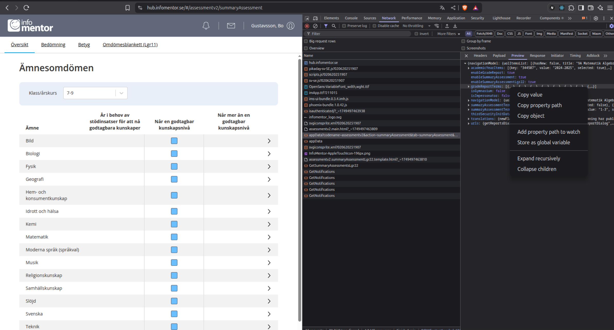

# Infomentor Merit Calculator

A simple Ruby tool to calculate your total merit points for each school term based on grades exported from InfoMentor.

## How It Works

The script reads your grades from a `betyg.json` file and calculates your merit points for each term using the Swedish grading scale:

| Grade | Points |
| ----- | ------ |
| A     | 20     |
| B     | 17.5   |
| C     | 15     |
| D     | 12.5   |
| E     | 10     |
| F     | 0      |

## How to Export Your Grades from InfoMentor

1. Open InfoMentor in your browser.
2. Navigate to the **Assesments** page
3. Right-click anywhere and select **Inspect** to open the developer tools.
4. Go to the **Network** tab.
5. Reload the page.
6. Find the request that starts with `appData?codename=assessmentv2&...`.
7. In the response, locate the line `"gradeReportTerms"`.
8. Right-click on it and select **Copy object**.
9. Paste the copied data into a file named `betyg.json` in the same folder as this script.



## Usage

1. Make sure you have Ruby installed.

2. Place your `betyg.json` file in the project folder.

3. Run the script:
   
   ```sh
   ruby main.rb
   ```
